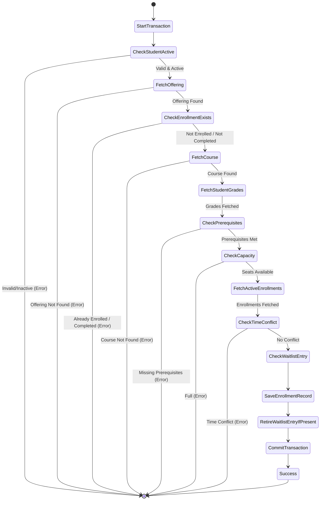

# NexusEnroll — Activity Diagram (Student Enrolment)

```mermaid
stateDiagram-v2
    [*] --> StartTransaction
    StartTransaction --> CheckStudentActive
    
    CheckStudentActive --> FetchOffering : Valid & Active
    CheckStudentActive --> [*] : Invalid/Inactive (Error)
    
    FetchOffering --> CheckEnrollmentExists : Offering Found
    FetchOffering --> [*] : Offering Not Found (Error)
    
    CheckEnrollmentExists --> FetchCourse : Not Enrolled / Not Completed
    CheckEnrollmentExists --> [*] : Already Enrolled / Completed (Error)
    
    FetchCourse --> FetchStudentGrades : Course Found
    FetchCourse --> [*] : Course Not Found (Error)
    
    FetchStudentGrades --> CheckPrerequisites : Grades Fetched
    
    CheckPrerequisites --> CheckCapacity : Prerequisites Met
    CheckPrerequisites --> [*] : Missing Prerequisites (Error)
    
    CheckCapacity --> FetchActiveEnrollments : Seats Available
    CheckCapacity --> [*] : Full (Error)
    
    FetchActiveEnrollments --> CheckTimeConflict : Enrollments Fetched
    
    CheckTimeConflict --> CheckWaitlistEntry : No Conflict
    CheckTimeConflict --> [*] : Time Conflict (Error)
    
    CheckWaitlistEntry --> SaveEnrollmentRecord
    SaveEnrollmentRecord --> RetireWaitlistEntryIfPresent
    RetireWaitlistEntryIfPresent --> CommitTransaction
    
    CommitTransaction --> Success
    Success --> [*]
```
