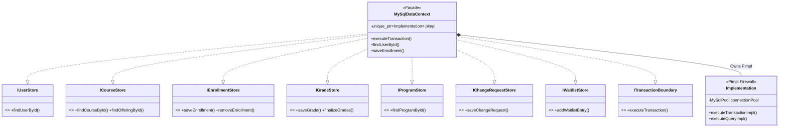
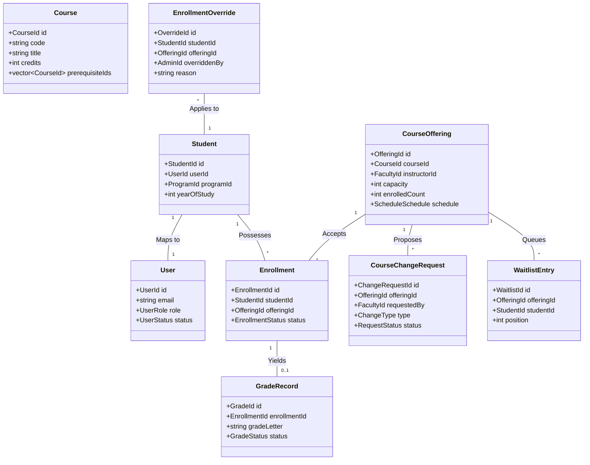

# NexusEnroll — Structural UML Class Architecture

The structural design of **NexusEnroll** mirrors all components, contracts, commands, queries, patterns, and data persistence models across the codebase.

---

## 1. Presentation Tier & Business CQRS Structure

```mermaid
classDiagram
    class api_routes {
        +registerRoutes()
        +registerFacultyRoutes()
        +registerAdministratorRoutes()
    }

    class ICommand {
        <<interface>>
        +execute() CommandResult
    }

    class EnrollStudentCommand {
        -StudentId studentId
        -OfferingId offeringId
        +execute() CommandResult
    }

    class DropCourseCommand {
        -StudentId studentId
        -OfferingId offeringId
        +execute() CommandResult
    }

    class JoinWaitlistCommand {
        -StudentId studentId
        -OfferingId offeringId
        +execute() CommandResult
    }

    class SubmitGradesCommand {
        -OfferingId offeringId
        -vector~GradeRecord~ records
        +execute() CommandResult
    }

    class FinalizeGradesCommand {
        -OfferingId offeringId
        +execute() CommandResult
    }

    class SubmitCourseChangeRequestCommand {
        -FacultyId facultyId
        -OfferingId offeringId
        -ChangeType type
        +execute() CommandResult
    }

    class OverrideEnrollmentCommand {
        -StudentId studentId
        -OfferingId offeringId
        -string reason
        +execute() CommandResult
    }

    class ApproveCourseChangeCommand {
        -ChangeRequestId requestId
        +execute() CommandResult
    }

    class RejectCourseChangeCommand {
        -ChangeRequestId requestId
        +execute() CommandResult
    }

    class BrowseCourseCatalogueQuery {
        +execute() CatalogueDto
    }

    class GetStudentScheduleQuery {
        +execute() ScheduleDto
    }

    class GetClassRosterQuery {
        +execute() RosterDto
    }

    class GetCapacityReportQuery {
        +execute() CapacityReportDto
    }

    api_routes --> ICommand : Dispatches
    api_routes --> BrowseCourseCatalogueQuery : Executes
    api_routes --> GetStudentScheduleQuery : Executes
    api_routes --> GetClassRosterQuery : Executes
    api_routes --> GetCapacityReportQuery : Executes

    EnrollStudentCommand ..|> ICommand
    DropCourseCommand ..|> ICommand
    JoinWaitlistCommand ..|> ICommand
    SubmitGradesCommand ..|> ICommand
    FinalizeGradesCommand ..|> ICommand
    SubmitCourseChangeRequestCommand ..|> ICommand
    OverrideEnrollmentCommand ..|> ICommand
    ApproveCourseChangeCommand ..|> ICommand
    RejectCourseChangeCommand ..|> ICommand
```

---

## 2. Creational (Factory Method) & Behavioural (Observer) Design Patterns

```mermaid
classDiagram
    class UserSession {
        <<abstract>>
        +userId() UserId
        +role() UserRole
    }

    class StudentSession {
        -StudentId studentId
        +studentId() StudentId
    }

    class FacultySession {
        -FacultyId facultyId
        +facultyId() FacultyId
    }

    class AdministratorSession {
        -AdminId adminId
        +adminId() AdminId
    }

    class SessionCreator {
        <<interface>>
        +createSession(UserId, string) unique_ptr~UserSession~
    }

    class StudentSessionCreator {
        +createSession(UserId, string) unique_ptr~UserSession~
    }

    class FacultySessionCreator {
        +createSession(UserId, string) unique_ptr~UserSession~
    }

    class AdministratorSessionCreator {
        +createSession(UserId, string) unique_ptr~UserSession~
    }

    class INotificationObserver {
        <<interface>>
        +notify(CourseSeatAvailable)
        +notifyDrop(CourseDropped)
    }

    class WaitlistNotificationObserver {
        +notify(CourseSeatAvailable)
    }

    class AdvisorNotificationObserver {
        +notifyDrop(CourseDropped)
    }

    class SystemAlertObserver {
        +notify(CourseSeatAvailable)
    }

    class NotificationPublisher {
        -vector~INotificationObserver*~ observers
        +subscribe(INotificationObserver*)
        +publish(CourseSeatAvailable)
        +publishDrop(CourseDropped)
    }

    StudentSession --|> UserSession
    FacultySession --|> UserSession
    AdministratorSession --|> UserSession

    StudentSessionCreator ..|> SessionCreator
    FacultySessionCreator ..|> SessionCreator
    AdministratorSessionCreator ..|> SessionCreator

    StudentSessionCreator ..> StudentSession : Instantiates
    FacultySessionCreator ..> FacultySession : Instantiates
    AdministratorSessionCreator ..> AdministratorSession : Instantiates

    WaitlistNotificationObserver ..|> INotificationObserver
    AdvisorNotificationObserver ..|> INotificationObserver
    SystemAlertObserver ..|> INotificationObserver

    NotificationPublisher --> INotificationObserver : Notifies Subscribers
```

---

## 3. Data Access Tier Contracts, Facade & Pimpl Firewall

---

## 4. Domain Entities & Domain Model Relationships

