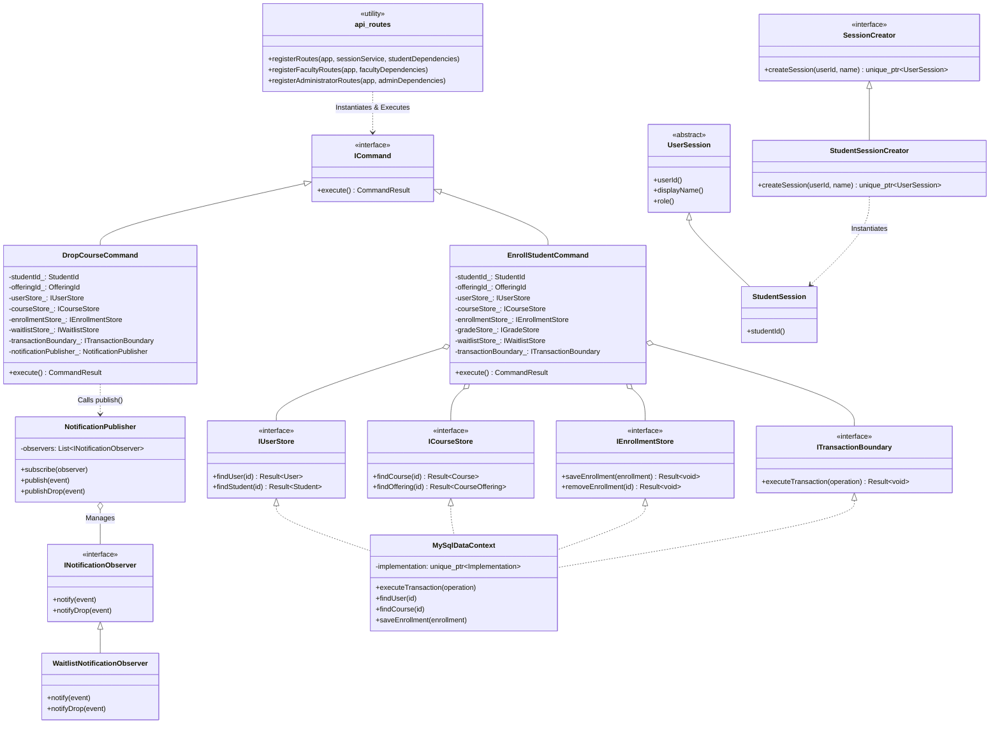

# NexusEnroll — Class Diagram

```mermaid
classDiagram
    %% Presentation Tier
    class api_routes {
        <<utility>>
        +registerRoutes(app, sessionService, studentDependencies)
        +registerFacultyRoutes(app, facultyDependencies)
        +registerAdministratorRoutes(app, adminDependencies)
    }

    %% Business Tier - Commands
    class ICommand {
        <<interface>>
        +execute() CommandResult
    }
    
    class EnrollStudentCommand {
        -studentId_: StudentId
        -offeringId_: OfferingId
        -userStore_: IUserStore
        -courseStore_: ICourseStore
        -enrollmentStore_: IEnrollmentStore
        -gradeStore_: IGradeStore
        -waitlistStore_: IWaitlistStore
        -transactionBoundary_: ITransactionBoundary
        +execute() CommandResult
    }
    
    class DropCourseCommand {
        -studentId_: StudentId
        -offeringId_: OfferingId
        -userStore_: IUserStore
        -courseStore_: ICourseStore
        -enrollmentStore_: IEnrollmentStore
        -waitlistStore_: IWaitlistStore
        -transactionBoundary_: ITransactionBoundary
        -notificationPublisher_: NotificationPublisher
        +execute() CommandResult
    }

    ICommand <|-- EnrollStudentCommand
    ICommand <|-- DropCourseCommand
    api_routes ..> ICommand : Instantiates & Executes

    %% Business Tier - Observer
    class NotificationPublisher {
        -observers: List~INotificationObserver~
        +subscribe(observer)
        +publish(event)
        +publishDrop(event)
    }

    class INotificationObserver {
        <<interface>>
        +notify(event)
        +notifyDrop(event)
    }

    class WaitlistNotificationObserver {
        +notify(event)
        +notifyDrop(event)
    }

    NotificationPublisher o-- INotificationObserver : Manages
    INotificationObserver <|-- WaitlistNotificationObserver
    DropCourseCommand ..> NotificationPublisher : Calls publish()

    %% Data Access Tier - Contracts
    class IUserStore {
        <<interface>>
        +findUser(id) Result~User~
        +findStudent(id) Result~Student~
    }

    class ICourseStore {
        <<interface>>
        +findCourse(id) Result~Course~
        +findOffering(id) Result~CourseOffering~
    }

    class IEnrollmentStore {
        <<interface>>
        +saveEnrollment(enrollment) Result~void~
        +removeEnrollment(id) Result~void~
    }
    
    class ITransactionBoundary {
        <<interface>>
        +executeTransaction(operation) Result~void~
    }

    %% Data Access Tier - Implementation
    class MySqlDataContext {
        -implementation: unique_ptr~Implementation~
        +executeTransaction(operation)
        +findUser(id)
        +findCourse(id)
        +saveEnrollment(enrollment)
    }

    IUserStore <|.. MySqlDataContext
    ICourseStore <|.. MySqlDataContext
    IEnrollmentStore <|.. MySqlDataContext
    ITransactionBoundary <|.. MySqlDataContext
    
    EnrollStudentCommand o-- IUserStore
    EnrollStudentCommand o-- ICourseStore
    EnrollStudentCommand o-- IEnrollmentStore
    EnrollStudentCommand o-- ITransactionBoundary

    %% Business Tier - Factory Method
    class UserSession {
        <<abstract>>
        +userId()
        +displayName()
        +role()
    }
    
    class StudentSession {
        +studentId()
    }
    
    class SessionCreator {
        <<interface>>
        +createSession(userId, name) unique_ptr~UserSession~
    }
    
    class StudentSessionCreator {
        +createSession(userId, name) unique_ptr~UserSession~
    }
    
    UserSession <|-- StudentSession
    SessionCreator <|-- StudentSessionCreator
    StudentSessionCreator ..> StudentSession : Instantiates
```
