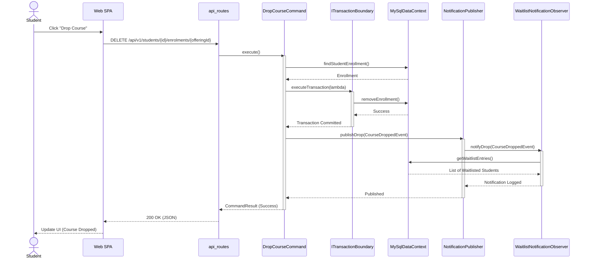

# NexusEnroll — Sequence Diagram (Student Drop Course & Notify)

```mermaid
sequenceDiagram
    actor Student
    participant SPA as Web SPA
    participant Router as api_routes
    participant Command as DropCourseCommand
    participant Tx as ITransactionBoundary
    participant Store as MySqlDataContext
    participant Pub as NotificationPublisher
    participant Obs as WaitlistNotificationObserver

    Student->>SPA: Click "Drop Course"
    SPA->>Router: DELETE /api/v1/students/{id}/enrolments/{offeringId}
    
    Router->>Command: execute()
    activate Command
    
    Command->>Store: findStudentEnrollment()
    Store-->>Command: Enrollment
    
    Command->>Tx: executeTransaction(lambda)
    activate Tx
    
    Tx->>Store: removeEnrollment()
    Store-->>Tx: Success
    
    Tx-->>Command: Transaction Committed
    deactivate Tx
    
    Command->>Pub: publishDrop(CourseDroppedEvent)
    activate Pub
    
    Pub->>Obs: notifyDrop(CourseDroppedEvent)
    activate Obs
    Obs->>Store: getWaitlistEntries()
    Store-->>Obs: List of Waitlisted Students
    Obs-->>Pub: Notification Logged
    deactivate Obs
    
    Pub-->>Command: Published
    deactivate Pub
    
    Command-->>Router: CommandResult (Success)
    deactivate Command
    
    Router-->>SPA: 200 OK (JSON)
    SPA-->>Student: Update UI (Course Dropped)
```
