# NexusEnroll — Interaction Sequence Diagrams

Exhaustive sequence diagrams for all primary commands, queries, and system interactions across Student, Faculty, Administrator, and Session modules.

---

## 1. Polymorphic Session Creation via Factory Method Pattern (`POST /api/v1/sessions`)

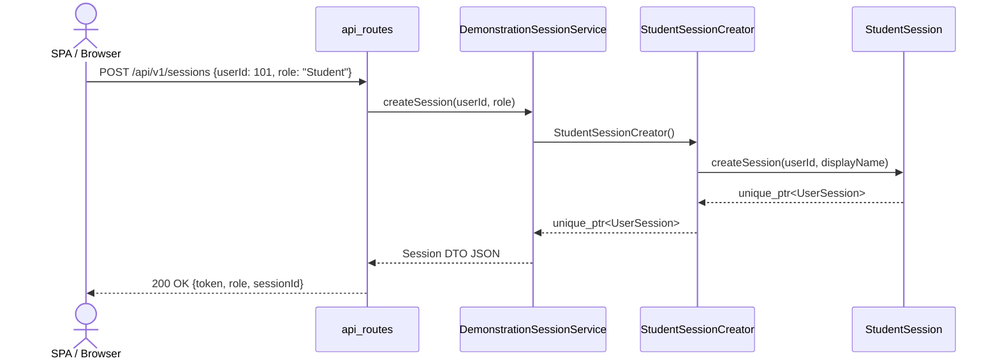

---

## 2. Student Course Enrolment Transaction (`EnrollStudentCommand`)

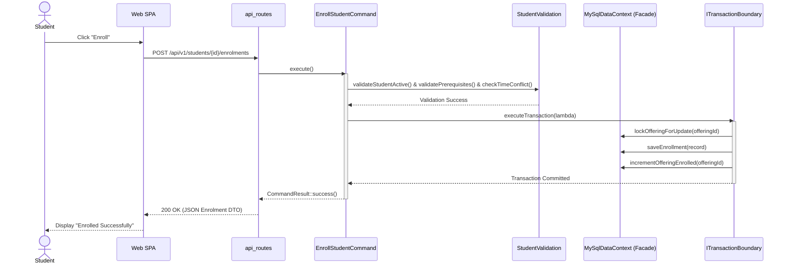

---

## 3. Student Course Drop & Decoupled Waitlist Notification (`DropCourseCommand`)

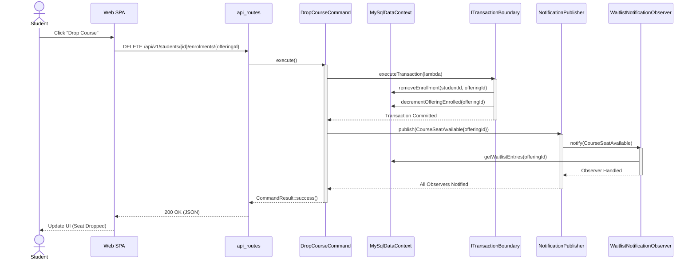

---

## 4. Student Join Waitlist Workflow (`JoinWaitlistCommand`)

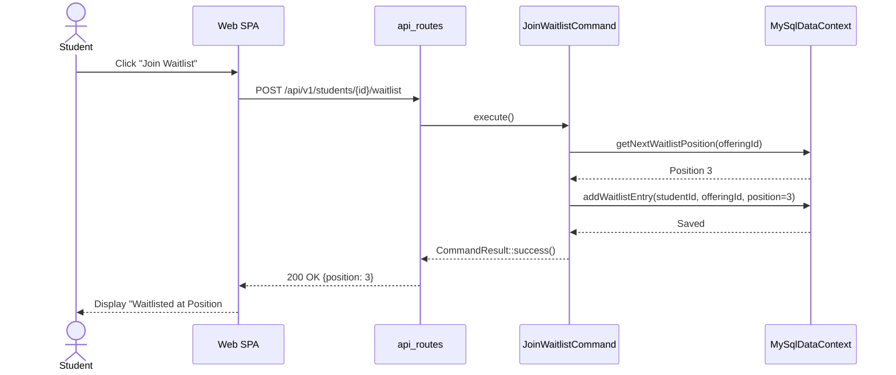

---

## 5. Student Read-Only Catalogue Query (`BrowseCourseCatalogueQuery`)

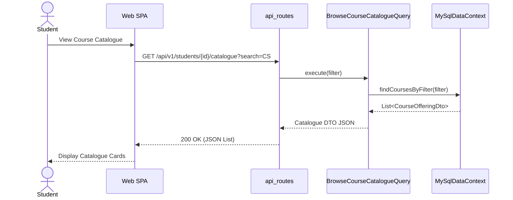

---

## 6. Faculty Grade Batch Draft Submission (`SubmitGradesCommand`)

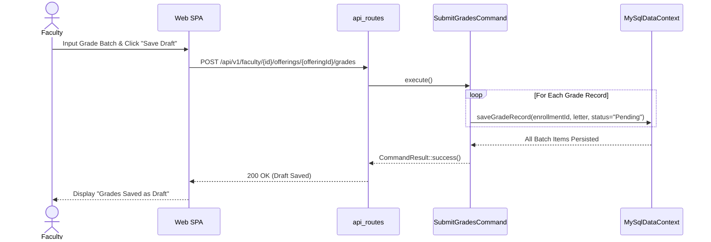

---

## 7. Faculty Atomic Grade Finalisation (`FinalizeGradesCommand`)

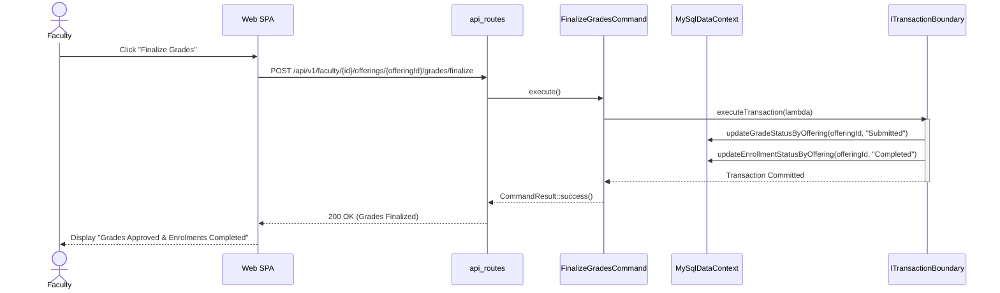

---

## 8. Faculty Course Change Request Submission (`SubmitCourseChangeRequestCommand`)

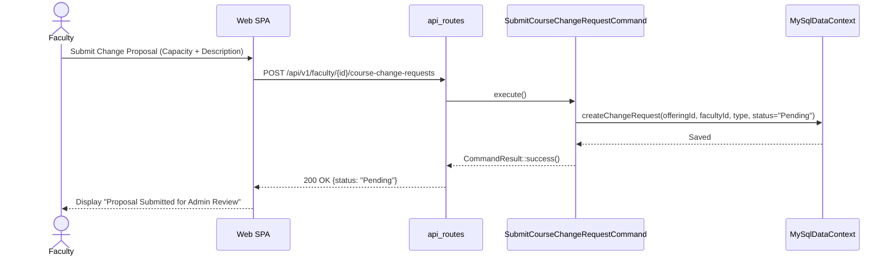

---

## 9. Administrator Enrolment Force-Add Override (`OverrideEnrollmentCommand`)

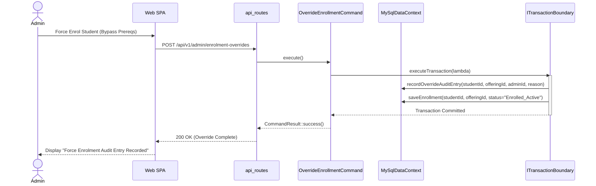

---

## 10. Administrator Course Change Approval Workflow (`ApproveCourseChangeCommand`)

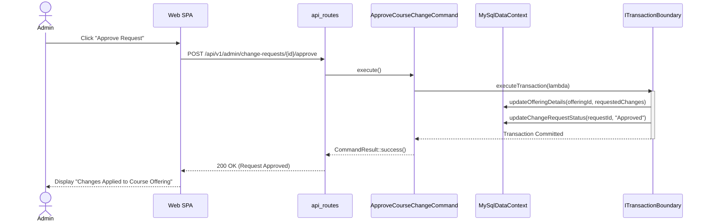

---

## 11. Administrator Course Change Rejection (`RejectCourseChangeCommand`)

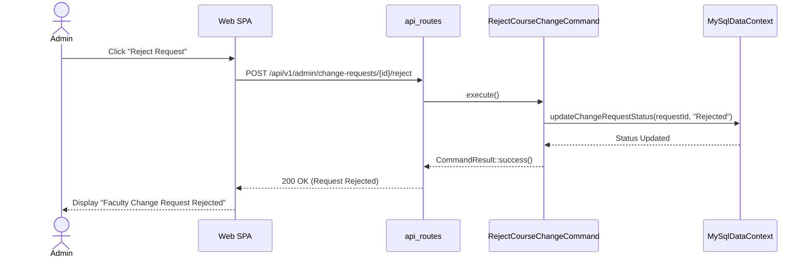

---

## 12. Administrator Provision User Account (`CreateAccountCommand`)

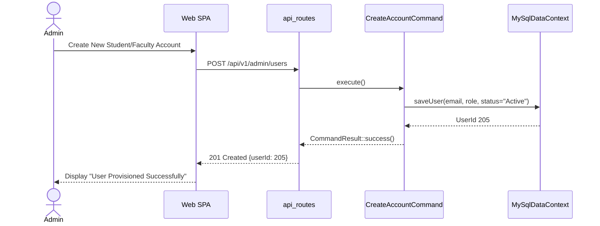

---

## 13. Administrator Read-Only CQRS Capacity Utilization Query (`GetCapacityReportQuery`)

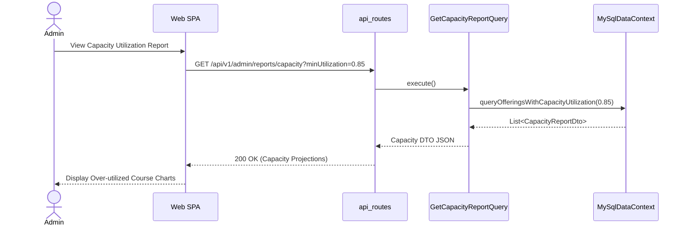
