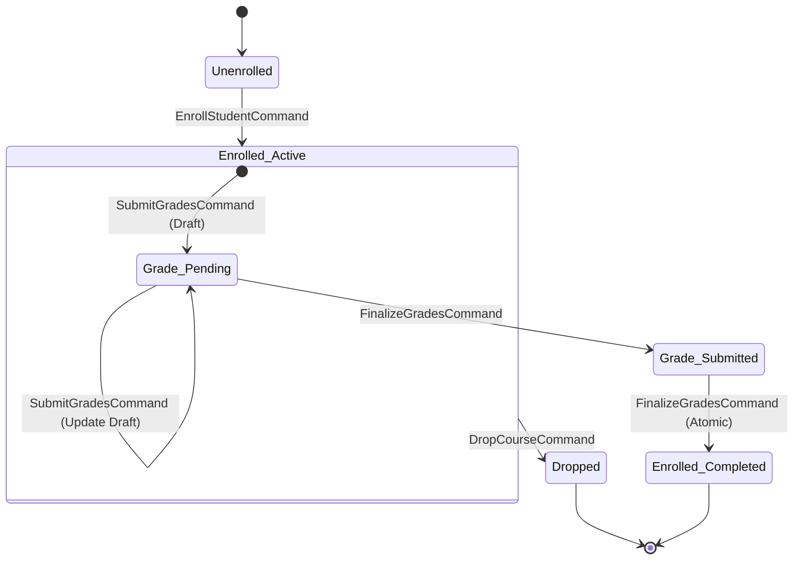
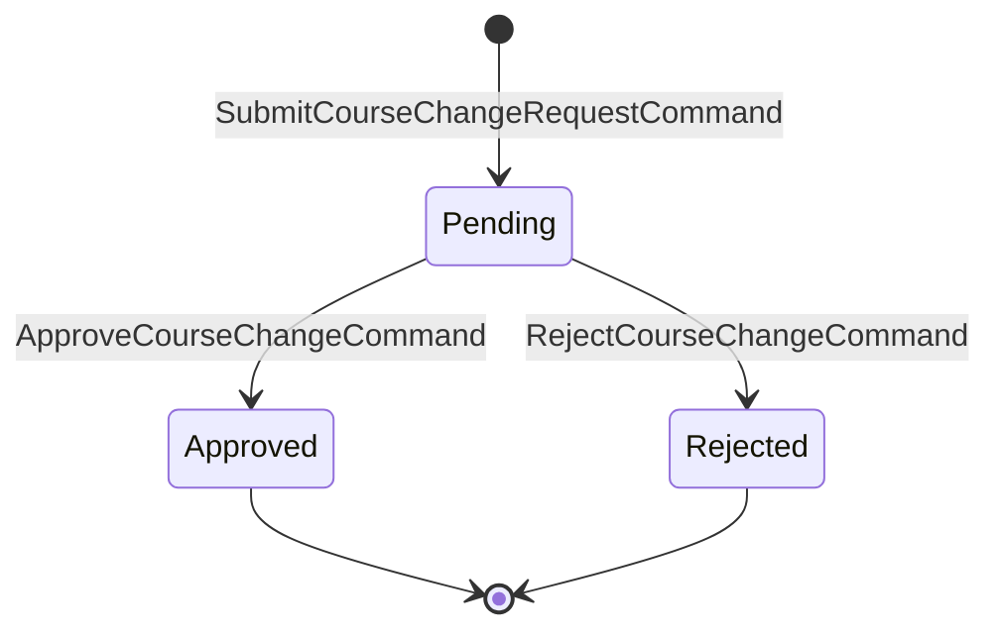

# NexusEnroll — State Diagram (Grade Lifecycle & Course Change Status)

## Enrollment & Grade Lifecycle State

```mermaid
stateDiagram-v2
    [*] --> Unenrolled
    
    Unenrolled --> Enrolled_Active : EnrollStudentCommand
    
    state Enrolled_Active {
        [*] --> Grade_Pending : SubmitGradesCommand (Draft)
        Grade_Pending --> Grade_Pending : SubmitGradesCommand (Update Draft)
    }
    
    Enrolled_Active --> Dropped : DropCourseCommand
    Dropped --> [*]
    
    Grade_Pending --> Grade_Submitted : FinalizeGradesCommand
    Grade_Submitted --> Enrolled_Completed : FinalizeGradesCommand (Atomic)
    Enrolled_Completed --> [*]
```

## Course Change Request State

```mermaid
stateDiagram-v2
    [*] --> Pending : SubmitCourseChangeRequestCommand
    
    Pending --> Approved : ApproveCourseChangeCommand
    Pending --> Rejected : RejectCourseChangeCommand
    
    Approved --> [*]
    Rejected --> [*]
```
