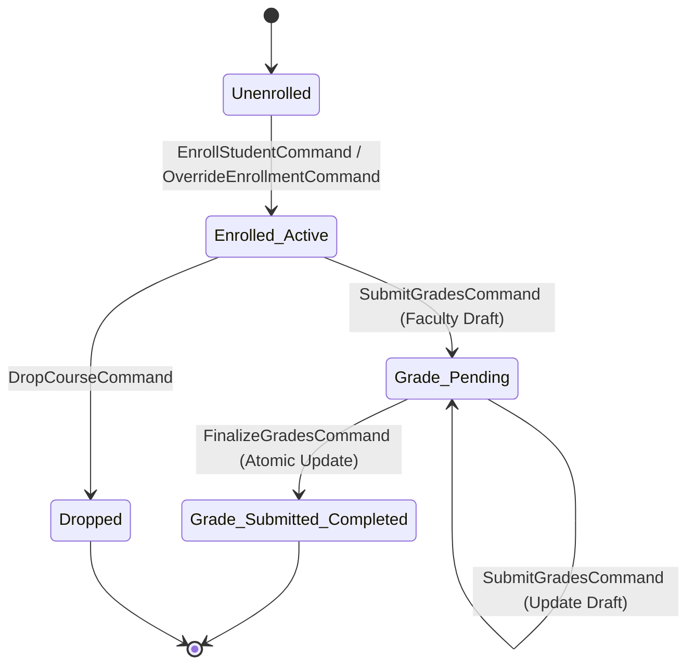
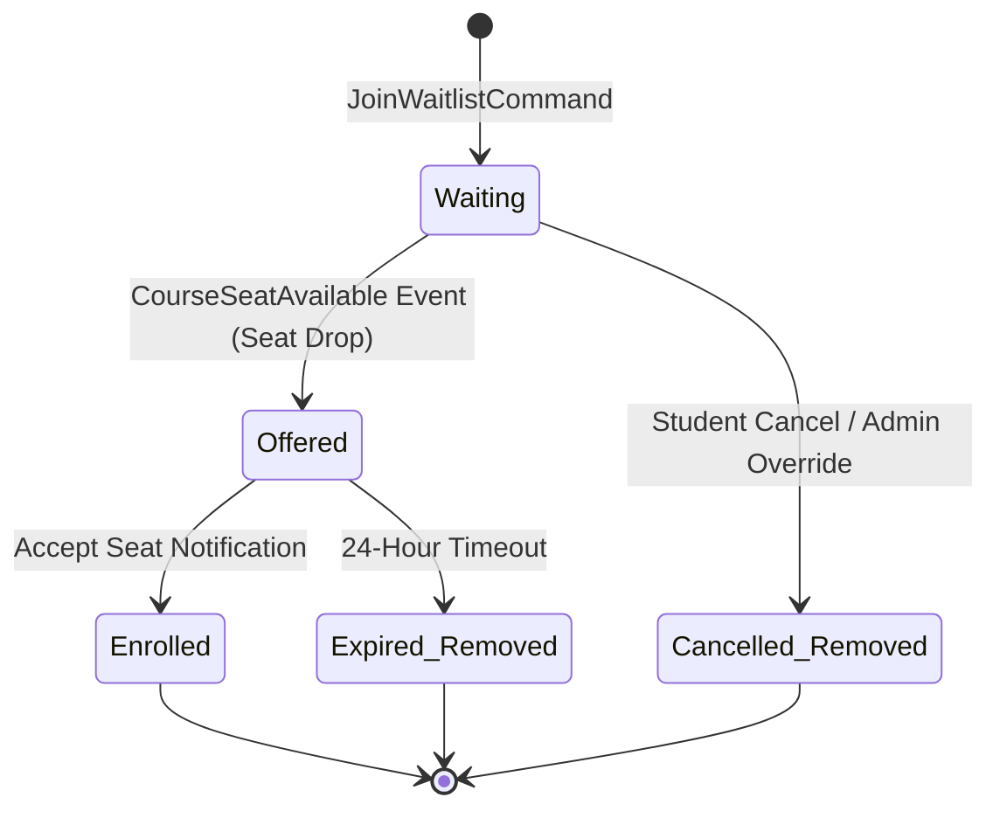
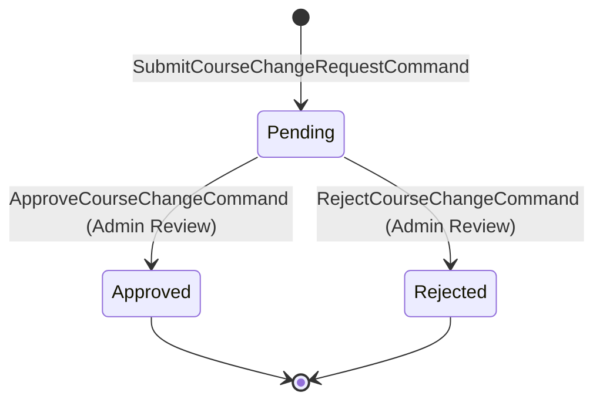
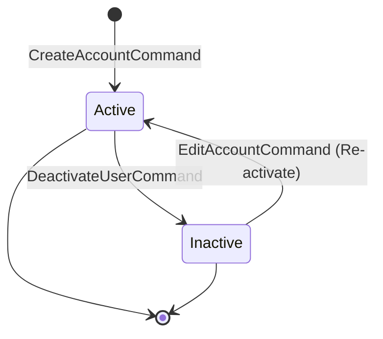

# NexusEnroll — State Lifecycle Diagrams

Complete state machine specifications for all stateful entities and lifecycle workflows in the NexusEnroll domain model.

---

## 1. Enrolment & Grade Lifecycle State Machine

---

## 2. Waitlist Entry Lifecycle State Machine

---

## 3. Faculty Course Change Request Lifecycle State Machine

---

## 4. User Account Status Lifecycle State Machine

